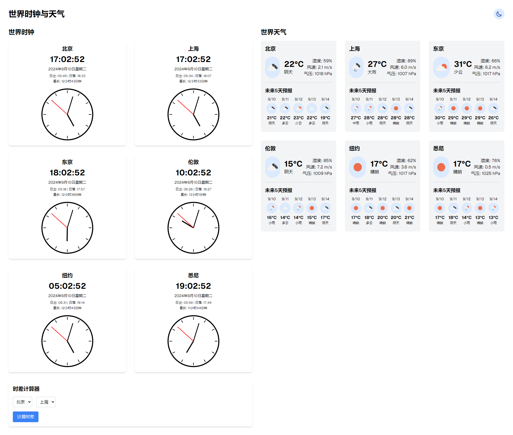
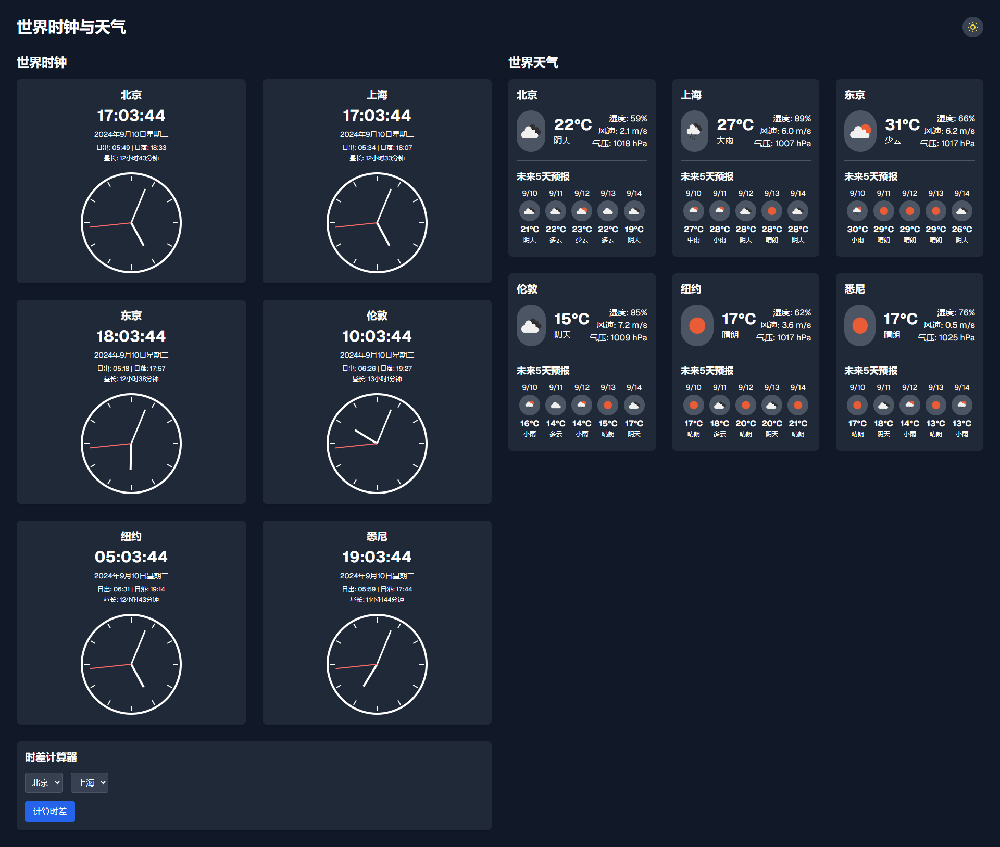

# 世界时钟与天气应用

这是一个基于 Next.js 开发的世界时钟与天气应用，提供多个城市的实时时间和天气信息。

<div style="display: flex; justify-content: space-between;">
  
  
</div>

## 快速开始

### 前置要求

- Node.js (推荐版本 14.0.0 或更高)
- npm (通常随 Node.js 一起安装)

### 安装

1. 克隆仓库：
   ```bash
   git clone https://github.com/ivesyi/world-clock-weather-app.git
   cd world-clock-weather-app
   ```

2. 安装依赖：
   ```bash
   npm install
   ```

3. 创建 `.env.local` 文件，并添加您的 OpenWeatherMap API 密钥：
   ```bash
   NEXT_PUBLIC_OPENWEATHERMAP_API_KEY=your_api_key_here
   ```

### 运行

   ```bash
   npm run dev
   ```

   打开浏览器访问 `http://localhost:3000` 查看应用。

## 主要功能

1. **世界时钟**
   - 显示多个主要城市的当前时间
   - 每个城市时钟包含以下信息：
     - 城市名称
     - 当前时间（数字显示）
     - 当前日期
     - 日出和日落时间
     - 昼长时间
     - 模拟时钟显示

2. **世界天气**
   - 显示多个主要城市的实时天气信息
   - 每个城市的天气信息包括：
     - 当前温度
     - 天气状况（包括细分的云量和降雨量描述）
     - 湿度
     - 风速
     - 气压
   - 提供未来5天的天气预报

3. **时差计算器**
   - 允许用户计算不同城市之间的时差

4. **深色模式切换**
   - 提供深色/浅色模式切换功能，改善用户体验

## 支持的城市

应用当前支持以下城市的时间和天气信息：

- 北京
- 上海
- 东京
- 伦敦
- 纽约
- 悉尼

## 技术特点

- 使用 React Hooks 进行状态管理
- 响应式设计，适配不同屏幕尺寸
- 实时数据更新（每10分钟自动刷新天气数据）
- 自定义 SVG 时钟显示
- 使用外部 API 获取准确的日出日落时间和天气数据
- 根据云量和降雨量细分天气状况描述

## 部署

这个应用可以部署到任何支持 Next.js 的平台，如 Vercel、Netlify 或自托管服务器。

详细的部署说明，请参考 [Next.js 部署文档](https://nextjs.org/docs/deployment)。